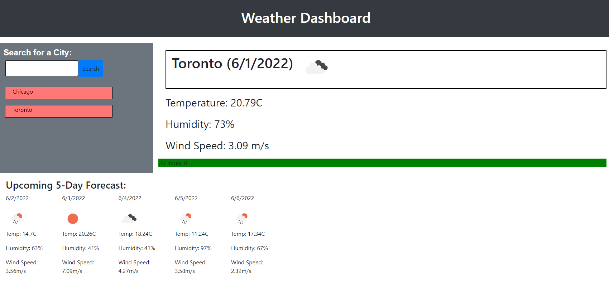

# 06 Server-Side APIs: Weather Dashboard
## Module 6 Challenge

## Description
The goal of this challenge was to create a weather dashboard which displys the weather outlook for multiple cities so a traveler can plan their trip accordingly. In order for the weather dashboard to be a sucess it must satisfy a certain list of criteria items which include:
* When a city is searched:
    - user is presented with the current and future conditions for that city
    - the city is saved under their seach history, and can be clicked again to reappear on screen
* The current weather conditions will display:
    - City name, current date, icon showing what the weather is like, temperature, humidity, wind speed, and the UV index
    - UV Index will have a color indicating where the value is on the index and exposure levels
* The future conditions will display the forecast for the next 5 days in the searched city more specifically:
    - Date, icon showing what the weather is like, temperature, humidity, and wind speed

## Screenshot

## Website
This [link](https://tyomoto.github.io/refactored-lamp/) will take you to deployed application on github pages.
